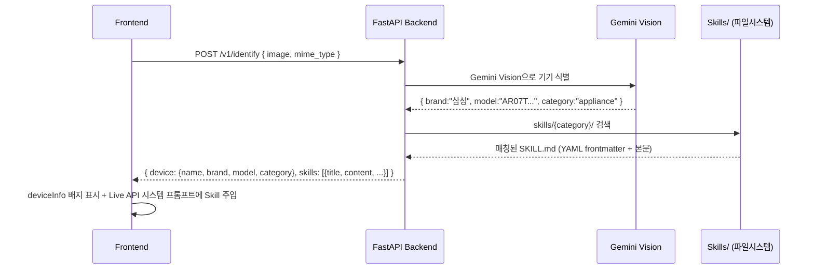

# 바로봄 — 개발자 가이드

> **마지막 업데이트**: 2026-07-18  
> **담당**: @itsallgoodman  
> **백엔드 서버**: `yoonjuho14@192.168.45.155`

---

## 아키텍처 개요

```
┌─────────────────┐       ┌─────────────────────────┐
│  Next.js 프론트엔드 │       │  FastAPI 백엔드 (텔레메트리) │
│  localhost:4173   │       │  192.168.45.155:8000    │
│                   │       │                         │
│  src/App.jsx      │       │  POST /v1/events  ◀────│─── 사용자 행동 이벤트
│  src/lib/anonId   │───▶──│  GET  /health           │
│  src/lib/feedback │       │                         │
│                   │       │  SQLite (barobom.db)    │
│  /api/analyze     │───▶──│  Langfuse (대기 중)     │
│  (Gemini Vision)  │       └──────────┬──────────────┘
│                   │                  │
└───────────────────┘       ┌──────────▼──────────────┐
                            │  Cloudflare Tunnel       │
                            │  dev.amanhasfalle...     │
                            └──────────────────────────┘
```

**핵심**: 프론트엔드는 Gemini에 직접 이미지 분석을 요청하고, 사용자 행동(가이드 시작·단계 이동·완료 등)을 백엔드로 전송합니다. 백엔드는 수집된 이벤트를 SQLite에 저장하고, 추후 Langfuse로 트레이싱합니다.

---

## 빠른 시작

```bash
# 1. 클론
git clone <repo-url>
cd barobom-ai-guide

# 2. 의존성 설치 (lockfile 기준)
npm ci

# 3. 환경변수 설정
cp .env.example .env.local
# → .env.local 에 GEMINI_API_KEY=실제키 입력

# 4. 실행
npm run dev
# → http://localhost:4173
```

---

## 환경변수 (`.env.local`)

| 변수 | 필수 | 설명 | 기본값 |
|---|---|---|---|
| `GEMINI_API_KEY` | ✅ | Gemini API 키 | — |
| `NEXT_PUBLIC_API_BASE_URL` | ❌ | 텔레메트리 백엔드 주소 | `https://dev.amanhasfallenintotheriver.space` |
| `FASTAPI_URL` | ❌ | M2+ AI 백엔드 주소 | `http://localhost:8000` |
| `GEMINI_MODEL` | ❌ | Gemini 모델명 | `gemini-3.5-flash` |

> **Gemini 키 발급**: [Google AI Studio](https://aistudio.google.com/apikey) → "API 키 만들기"

---

## 프로젝트 구조 (2026-07-19 기준)

```
barobom-ai-guide/
├── app/
│   ├── api/analyze/
│   │   ├── route.js          # Gemini Vision Route Handler (서버 전용)
│   │   └── route.test.js     # 3 tests (MISSING_CONFIG, 빈 키, 정상흐름)
│   ├── api/live-key/
│   │   └── route.js          # Live API 키 제공 (GEMINI_API_KEY 안전 전달)
│   ├── layout.jsx            # 루트 레이아웃
│   ├── page.jsx              # 홈 페이지 (Server Component)
│   └── page.test.jsx         # 1 test
├── server/
│   ├── analyzer.js           # Gemini 프롬프트 빌더 + bbox 정규화
│   └── analyzer.test.js      # 4 tests
├── src/
│   ├── App.jsx               # 메인 Client Component (전체 UI 상태 + Live API 통합)
│   ├── App.test.jsx          # 8 tests (사용자 흐름)
│   ├── styles.css            # 고령층 친화 스타일
│   ├── styles.test.js        # 1 test
│   ├── testSetup.js          # Vitest + jsdom 셋업
│   └── lib/
│       ├── anonId.js         # 익명 사용자 ID (localStorage 기반)
│       ├── anonId.test.js    # 6 tests
│       ├── feedback.js       # 텔레메트리 이벤트 발행 + 기기 식별 (/v1/identify)
│       ├── feedback.test.js  # 5 tests
│       ├── liveVoice.js      # Gemini Live API WebSocket (실시간 음성+카메라)
│       ├── liveVoice.test.js # tests
│       ├── imageBounds.js    # 이미지 좌표 정규화 (object-fit: contain)
│       └── imageBounds.test.js # tests
├── skills/
│   ├── README.md             # SKILL.md 작성 가이드 (YAML frontmatter 규격)
│   ├── kiosk/
│   │   └── easy-kiosk-ek-192.md
│   ├── appliance/
│   │   ├── lg-tromm.md
│   │   └── samsung-ac-remote.md
│   └── boiler/
│       └── kd-navian-ctr5500.md
├── docs/
│   └── api/analyze.md        # POST /api/analyze API 레퍼런스
├── scripts/
│   └── test-image.js         # 테스트용 이미지 생성
├── .env.example              # 환경변수 템플릿
├── .env.local                # 로컬 환경변수 (gitignore)
├── .hermes/plans/            # SKILL.md 자기 발전 시스템 계획서
├── package.json
├── eslint.config.mjs
├── next.config.mjs
└── vitest.config.js
```

---

## API 엔드포인트

### `POST /api/analyze` (Next.js Route Handler)

Gemini Vision으로 이미지 분석 → 목표 + 단계 + bbox 반환.

| 상태 | 의미 |
|---|---|
| `200` | 분석 성공 (`goals` 배열) |
| `400` | 이미지 누락 / JSON 파싱 실패 / MIME 오류 |
| `500` | 내부 오류 |
| `502` | Gemini API 호출 실패 |
| `503` | `GEMINI_API_KEY` 누락 (`MISSING_CONFIG`) |

자세한 스펙: [`docs/api/analyze.md`](./docs/api/analyze.md)

---

## 백엔드 서버 (텔레메트리)

### 접속 정보

- **도메인**: `https://dev.amanhasfallenintotheriver.space`
- **서버**: `yoonjuho14@192.168.45.155`
- **코드 위치**: `~/barobom-backend/`
- **프로세스**: uvicorn `0.0.0.0:8000` (pid 383418)
- **DB**: SQLite `~/barobom-backend/barobom.db`

### 엔드포인트

#### `GET /health`
```json
{"status": "ok"}
```

#### `POST /v1/events`

```json
// Request
{
  "anonymous_id": "test-anon-xxxxxxxxxxx001",
  "event_type": "guide_started",
  "session_id": "optional-existing-session-id",
  "payload": { "optional": "metadata" }
}

// Response (201)
{
  "session_id": "250f8a98-ba32-4493-843a-4850c0f7434d"
}
```

#### `POST /v1/identify` — 기기 식별 + SKILL.md 매칭

```json
// Request
{
  "image": "<base64-encoded-image>",
  "mime_type": "image/jpeg"
}

// Response (200)
{
  "device": {
    "name": "Easy Kiosk EK-192",
    "brand": "이지포스/KICC",
    "model": "EK-192",
    "category": "kiosk"
  },
  "skills": [
    {
      "title": "Easy Kiosk EK-192",
      "content": "## ⚠️ 먼저 확인하세요\n\n...",
      "brand": "이지포스/KICC",
      "model": "EK-192",
      "category": "kiosk"
    }
  ],
  "raw_analysis": "Gemini Vision analysis result..."
}
```

**파이프라인**: Gemini Vision으로 기기 식별 → `skills/{category}/*.md` 검색 → YAML frontmatter 매칭 → Skill 내용 반환

**유효한 `event_type`** (9개):

| 이벤트 | 트리거 | App.jsx 위치 |
|---|---|---|
| `guide_started` | 목표 선택 | `chooseGoal()` |
| `step_shown` | 다음 단계로 이동 | `nextStep()` |
| `step_back` | 이전 단계로 이동 | 가이드 컨트롤 |
| `step_repeated` | "다시 듣기" 버튼 | 가이드 컨트롤 |
| `goal_completed` | 마지막 단계 완료 | `nextStep()` (isLastStep) |
| `guide_abandoned` | "처음부터" 리셋 | `reset()` |
| `new_photo_uploaded` | 새 사진 분석 완료 | `handleFile()` |
| `screen_changed` | (예약) | — |
| `user_reported_wrong` | (예약) | — |

### 서버 코드 구조

```
~/barobom-backend/
├── api/
│   ├── app/
│   │   ├── main.py           # FastAPI 앱 (lifespan, CORS, /health)
│   │   ├── db.py             # SQLAlchemy 엔진 + 세션 (SQLite)
│   │   ├── models/
│   │   │   ├── session.py    # UserSession (id, anonymous_id, user_agent, timestamps)
│   │   │   └── event.py      # UserEvent (session_id, anonymous_id, event_type, payload)
│   │   ├── routers/
│   │   │   └── events.py     # POST /v1/events (검증 + 저장 + Langfuse trace)
│   │   └── ai/
│   │       └── trace.py      # Langfuse 통합 (no-op until credentials set)
│   └── tests/
│       ├── conftest.py       # DB 초기화/정리 fixture
│       └── test_events.py    # 7 tests
├── .env.example
├── requirements.txt
└── .venv/                    # Python 3.14 가상환경
```

### 서버 재시작 방법

```bash
ssh yoonjuho14@192.168.45.155
cd ~/barobom-backend
source .venv/bin/activate
pkill -f "uvicorn.*app.main"
nohup python -m uvicorn api.app.main:app --host 0.0.0.0 --port 8000 > /tmp/uvicorn.log 2>&1 &
```

---

## Gemini Live API (실시간 음성 + 카메라)

### 아키텍처 개요

```
┌─────────────────────────┐       ┌──────────────────────────────┐
│  Next.js 프론트엔드        │       │  Google Gemini Live API        │
│  src/lib/liveVoice.js    │       │  (WebSocket)                   │
│                          │       │                                │
│  AudioWorklet (16kHz) ───▶─────▶│  models/gemini-3.1-flash-      │
│  AudioWorklet (24kHz) ◀──◀─────│  live-preview                   │
│  Video frames (1 FPS)  ───▶────▶│                                │
└──────────┬──────────────┘       └────────────────────────────────┘
           │
           │ GET /api/live-key
           ▼
┌──────────────────────────┐
│  Route Handler            │
│  (GEMINI_API_KEY 노출 X)  │
└──────────────────────────┘
```

**핵심**: Gemini Live API WebSocket을 통해 오디오는 16kHz PCM → 24kHz PCM으로 실시간 스트리밍됩니다. 영상은 1 FPS JPEG 프레임으로 전송됩니다.

### `GET /api/live-key`

브라우저에 `GEMINI_API_KEY`를 안전하게 전달하는 Route Handler입니다.

```
GET /api/live-key → { "key": "AIza..." }  또는  { "key": "" }
```

| 상태 | 의미 |
|---|---|
| `200` | 키 반환 (빈 문자열이면 키 미설정) |

> API 키는 서버 측 `.env.local`에서만 읽으므로 브라우저 번들에 노출되지 않습니다.

### `src/lib/liveVoice.js` 아키텍처

```
startLiveSession(apiKey, opts) → { speak, speakWithVision, mute, unmute, stop, sendText, state }
```

| 기능 | 구현 상세 |
|---|---|
| **마이크 입력** | AudioWorklet (16kHz PCM), `getUserMedia({ audio })` |
| **오디오 출력** | AudioWorklet (24kHz PCM), Int16 → Float32 변환 후 재생 |
| **영상 입력** | `getUserMedia({ video, facingMode: 'environment' })` → Canvas → JPEG (1 FPS) |
| **정적 이미지 fallback** | `startStaticFrameLoop(imageBase64)` — 카메라 없을 때 업로드 이미지를 1 FPS로 전송 |
| **음소거** | `isMuted` 플래그로 AudioWorklet 출력 차단 |
| **VAD** | Gemini Live API `automaticActivityDetection` (2초 무음 감지) |
| **한국어 음성** | `speechConfig.voiceConfig.prebuiltVoiceConfig.voiceName: 'Kore'` |
| **모델** | `models/gemini-3.1-flash-live-preview` |

### `speak()` vs `speakWithVision()` 통합 모드

#### `speak(imageBase64)` — 정적 이미지 모드
1. WebSocket 연결 및 AudioWorklet 초기화
2. `setupComplete` 대기
3. `clientContent.turns[]`로 이미지 전송 (`turnComplete: false`)
4. 마이크 스트림 연결 → VAD가 사용자 음성을 감지하면 응답 시작

#### `speakWithVision(imageBase64, imageMimeType)` — 통합 모드
1. 마이크 + 카메라 권한 동시 요청
2. 카메라 성공 → `initVideoFrames()`로 1 FPS 실시간 영상 전송
3. 카메라 실패 → `startStaticFrameLoop()`로 정적 이미지 fallback
4. 마이크 스트림 연결 → 자연어 대화 시작

### App.jsx 통합 흐름 (`toggleLiveVision()`)

```
1. /api/live-key로 API 키 가져오기
2. identifyDevice()로 백엔드 /v1/identify 호출 → SKILL.md 매칭
3. createLiveSession(apiKey, skills) 호출
   - 시스템 프롬프트에 현재 단계 + 매칭된 Skill 내용 주입
4. session.speakWithVision(imageBase64, imageMimeType) 호출
5. 상태: idle → connecting → listening ↔ muted
```

### 백엔드 `/v1/identify` → SKILL.md 검색 파이프라인



**`identifyDevice(imageBase64, mimeType)`** (`src/lib/feedback.js`):
- `NEXT_PUBLIC_API_BASE_URL/v1/identify`로 POST 요청
- fire-and-forget (실패해도 UX 차단 안 함)
- 응답: `{ device: {name, brand, model, category}, skills: [{title, content, ...}], raw_analysis: "..." }`

**SKILL.md 형식** (`skills/README.md` 참조):
```yaml
---
device:
  name: "Easy Kiosk EK-192"
  category: "kiosk"
  brand: "이지포스/KICC"
  model: "EK-192"
  visual_clues:
    - "화면 상단 로고"
    - "하단 모델명 표기"
  usage_context: "무인 주문 키오스크"
version: "1.0.0"
status: "published"
created: "2026-07-18"
---
```


### 프론트엔드

```bash
npm test          # 전체 27 tests (6 suites)
npm run test:watch # watch 모드
```

| Suite | Tests | 범위 |
|---|---|---|
| `server/analyzer.test.js` | 4 | bbox 정규화, 프롬프트 빌더 |
| `app/api/analyze/route.test.js` | 3 | MISSING_CONFIG, 빈 키, 정상흐름 |
| `app/page.test.jsx` | 1 | 페이지 렌더링 |
| `src/lib/anonId.test.js` | 6 | ID 생성/저장/복원/리셋 |
| `src/lib/feedback.test.js` | 5 | 이벤트 발행/세션/에러처리 |
| `src/App.test.jsx` | 8 | 사용자 흐름 UI |

### 백엔드

```bash
ssh yoonjuho14@192.168.45.155
cd ~/barobom-backend && source .venv/bin/activate
cd api && python -m pytest tests/ -v  # 7 tests
```

---

## Git 워크플로 & 커밋 컨벤션

```
main
 ├─ type(scope): 한국어 설명
 │
 ├─ feat:    새로운 기능
 ├─ fix:     버그 수정
 ├─ docs:    문서
 ├─ chore:   설정/의존성/빌드
 ├─ test:    테스트
 └─ refactor: 리팩토링
```

작업 상태는 `.hermes/plans/` 아래에 마일스톤 계획서로 관리됩니다.

---

## 현재 진행 상황 (2026-07-18)

### ✅ M0 — 기반 정비 (완료)

| Task | 커밋 |
|---|---|
| lockfile 동기화 | `303648e` |
| 환경변수 분리 + MISSING_CONFIG | `5e3a9b5` |
| API 계약 문서화 | `a498696` |

### ✅ M1 — 관측 수집 (완료)

| Task | 커밋 | 파일 |
|---|---|---|
| 익명 사용자 ID | `8e857b2` | `src/lib/anonId.js` |
| 텔레메트리 이벤트 발행 | `1f7f762` | `src/lib/feedback.js` |
| 백엔드 서버 + DB | — | `~/barobom-backend/` |
| Cloudflare Tunnel | — | `dev.amanhasfallenintotheriver.space` |
| Langfuse 트레이싱 | — | (no-op until credentials) |

### ⏳ M2 — 제품 식별 + Skill 검색 (진행 중)

| Task | 커밋 | 파일 |
|---|---|---|
| Gemini Live API WebSocket 클라이언트 | — | `src/lib/liveVoice.js` |
| `/api/live-key` Route Handler | — | `app/api/live-key/route.js` |
| `speakWithVision()` 통합 모드 | — | `src/lib/liveVoice.js` |
| SKILL.md 템플릿 + 가이드 | — | `skills/README.md` |
| 기기 Skill 작성 (Kiosk/Appliance/Boiler) | — | `skills/**/*.md` |
| `POST /v1/identify` — 기기 식별 | — | `src/lib/feedback.js` (`identifyDevice`) |
| Skill → Live API 시스템 프롬프트 주입 | — | `src/App.jsx` (`createLiveSession`) |

### ⏳ M3 — PostgreSQL/pgvector + Gemini Vision 연동 (예정)

- PostgreSQL/pgvector → 기기 지식 베이스
- `/v1/analyze` → Gemini Vision 전용 분석
- 디바이스 식별 정확도 개선

---

## 유용한 명령어 모음

```bash
# 프론트엔드
npm run dev         # 개발 서버 (localhost:4173)
npm test            # 전체 테스트
npm run lint        # ESLint
npm run build       # 프로덕션 빌드

# 백엔드 API 테스트
curl https://dev.amanhasfallenintotheriver.space/health
curl -X POST https://dev.amanhasfallenintotheriver.space/v1/events \
  -H 'Content-Type: application/json' \
  -d '{"anonymous_id":"test-xxxxxxxxxxx00001","event_type":"guide_started"}'
```

---

## 문제 해결

**Q: `npm ci`가 실패해요**  
A: `rm -rf node_modules package-lock.json && npm install` 후 다시 시도. lockfile이 동기화되어 있어야 합니다.

**Q: 사진 분석이 안 돼요 (`503 MISSING_CONFIG`)**  
A: `.env.local`에 `GEMINI_API_KEY`가 설정되어 있는지 확인하세요. 빈 문자열이나 공백만 있어도 실패합니다.

**Q: 텔레메트리 이벤트가 전송되지 않아요**  
A: 콘솔에 `[telemetry] ... failed:` 경고가 뜨는지 확인. 백엔드 서버가 실행 중인지 `curl /health`로 확인.

**Q: 백엔드 서버에 접속할 수 없어요**  
A: `ssh yoonjuho14@192.168.45.155` (비밀번호 필요 시 담당자에게 문의)
